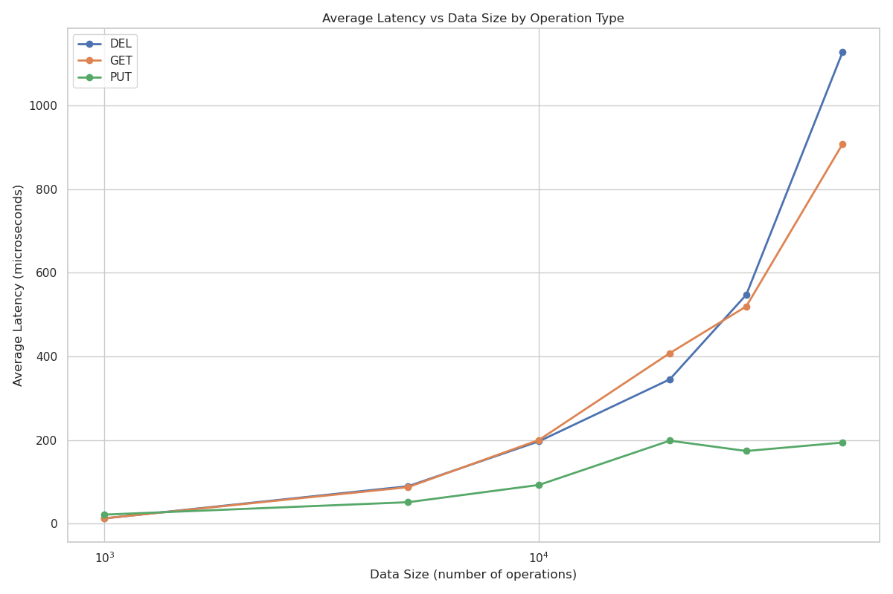
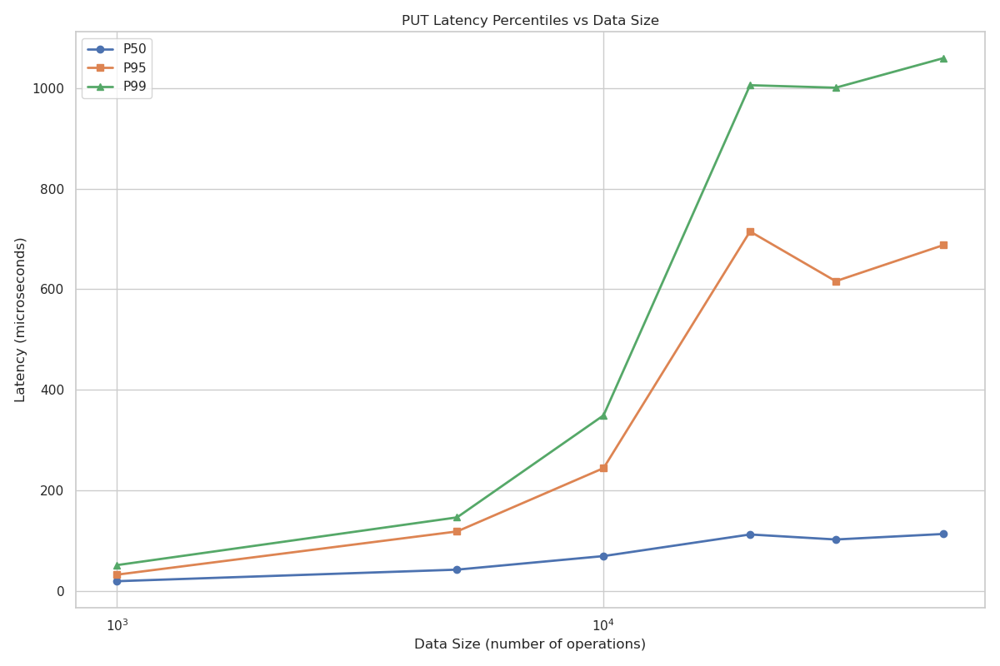
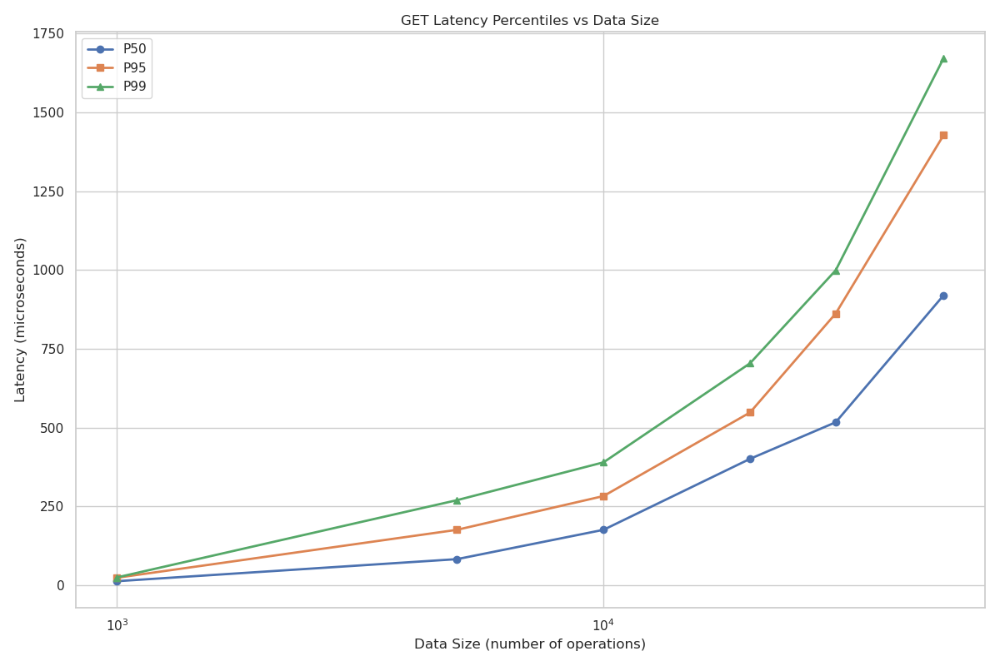
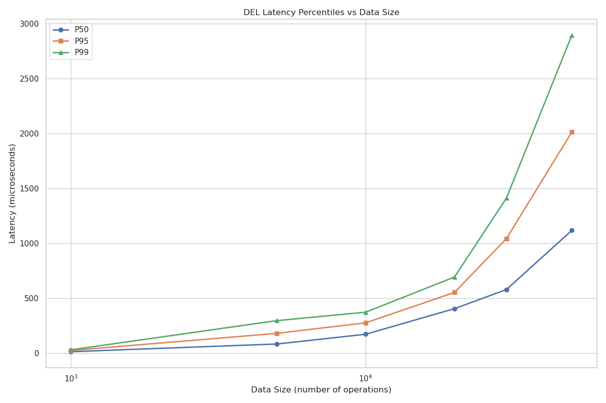
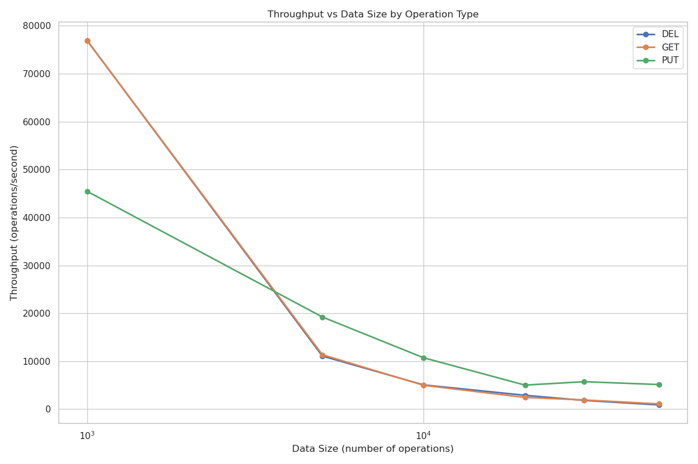
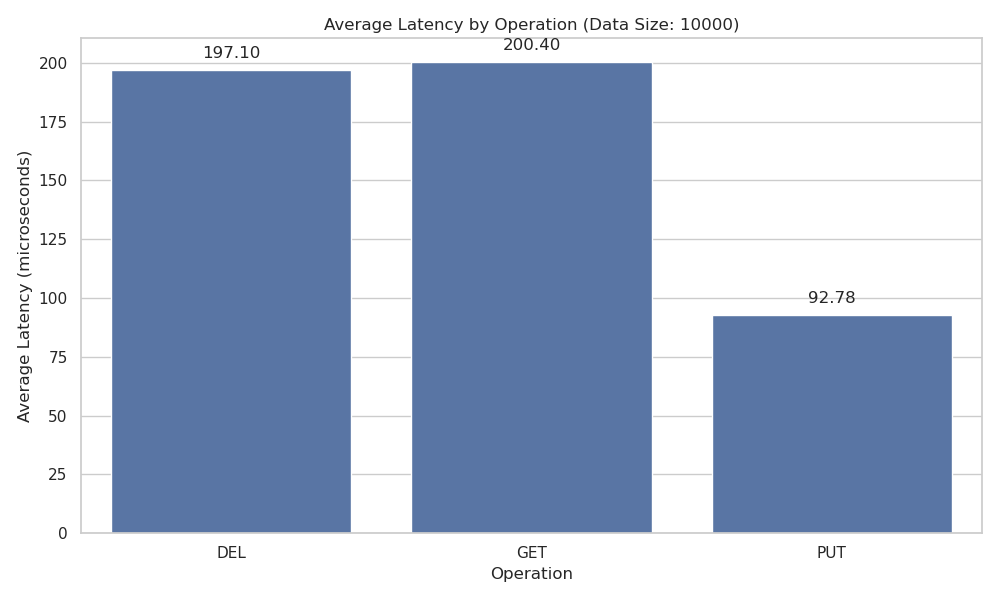
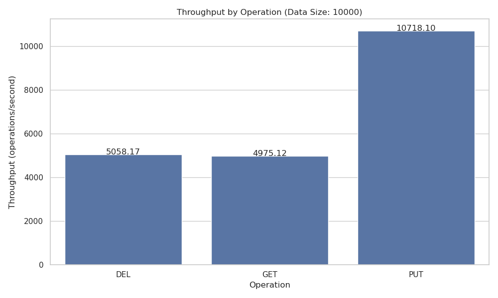
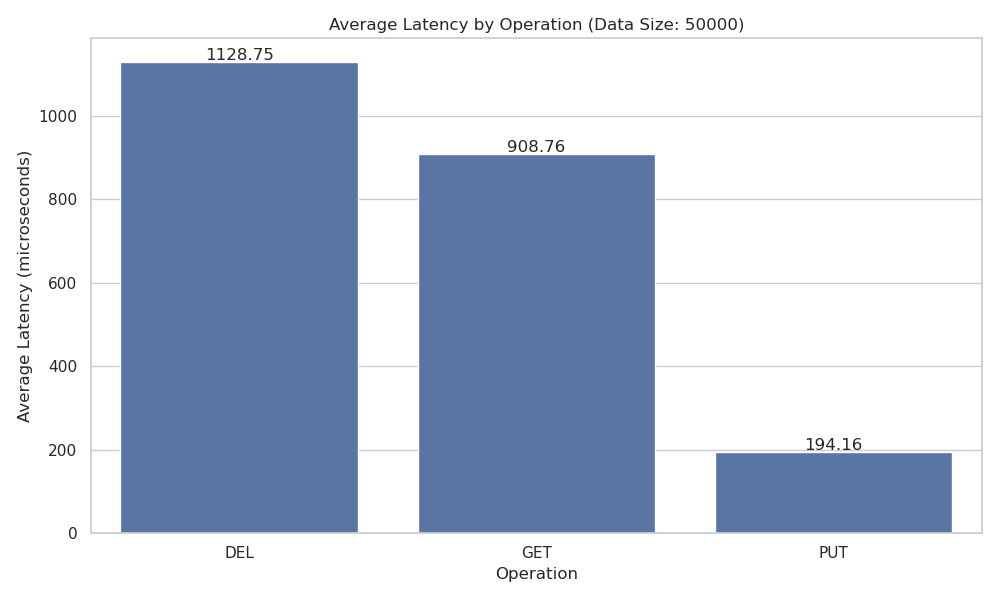
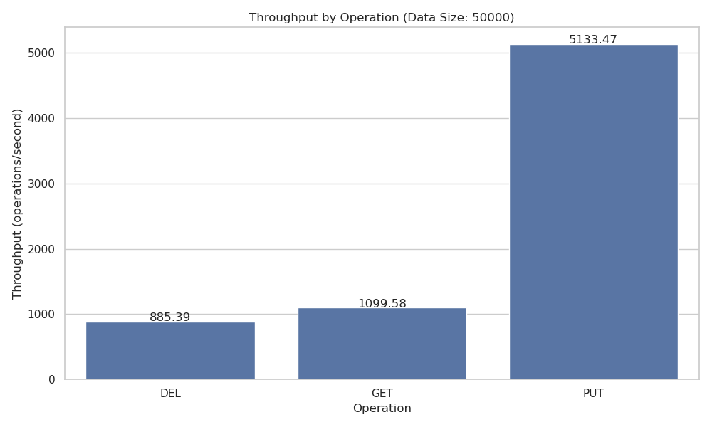

# LSM-Tree 性能测试报告

## 1. 测试环境

- **硬件环境**：
  - CPU：[填写 CPU 型号]
  - 内存：[填写内存大小]
  - 存储：[填写存储类型，如 SSD、HDD]
  
- **软件环境**：
  - 操作系统：[填写操作系统及版本]
  - 编译器：[填写编译器及版本]
  - 编译选项：[填写编译选项]

## 2. 测试参数

- **测试数据量**：10K、50K、100K、500K 操作
- **键范围**：1,000,000
- **值大小**：100 字节
- **测试操作**：PUT、GET、DEL

## 3. 性能测试结果

### 3.1 平均延迟分析

随着数据量的增加，三种操作的延迟变化趋势如下：

- **PUT 操作**：[分析 PUT 延迟变化趋势]
- **GET 操作**：[分析 GET 延迟变化趋势]
- **DEL 操作**：[分析 DEL 延迟变化趋势]

### 3.2 延迟分布分析

#### PUT 操作延迟分布

- **P50 延迟**：[分析 P50 延迟]
- **P95 延迟**：[分析 P95 延迟]
- **P99 延迟**：[分析 P99 延迟]

#### GET 操作延迟分布

- **P50 延迟**：[分析 P50 延迟]
- **P95 延迟**：[分析 P95 延迟]
- **P99 延迟**：[分析 P99 延迟]

#### DEL 操作延迟分布

- **P50 延迟**：[分析 P50 延迟]
- **P95 延迟**：[分析 P95 延迟]
- **P99 延迟**：[分析 P99 延迟]

### 3.3 吞吐量分析

随着数据量的增加，三种操作的吞吐量变化趋势如下：

- **PUT 操作**：[分析 PUT 吞吐量变化趋势]
- **GET 操作**：[分析 GET 吞吐量变化趋势]
- **DEL 操作**：[分析 DEL 吞吐量变化趋势]

### 3.4 不同数据量下的操作对比

#### 10K 操作

[分析 10K 数据量下各操作的性能表现]

#### 50K 操作

[分析 50K 数据量下各操作的性能表现]

#### 100K 操作

[分析 100K 数据量下各操作的性能表现]

#### 500K 操作

[分析 500K 数据量下各操作的性能表现]

## 4. 性能分析与结论

### 4.1 性能瓶颈分析

- **内存操作**：[分析内存操作的性能影响]
- **磁盘 I/O**：[分析磁盘 I/O 的性能影响]
- **合并操作**：[分析合并操作的性能影响]
- **其他因素**：[分析其他影响性能的因素]

### 4.2 LSM-Tree 特性分析

- **分层存储**：[分析分层存储对性能的影响]
- **合并策略**：[分析合并策略对性能的影响]
- **内存使用**：[分析内存使用对性能的影响]

### 4.3 优化建议

1. [优化建议 1]
2. [优化建议 2]
3. [优化建议 3]
4. [优化建议 4]

### 4.4 总结

[对整体性能测试结果的总结和最终结论]

## 5. 附录

### 5.1 原始测试数据

[可以附上完整的测试数据或者链接到 CSV 文件]

### 5.2 测试代码

[可以附上测试代码的关键部分或链接到源代码库] 